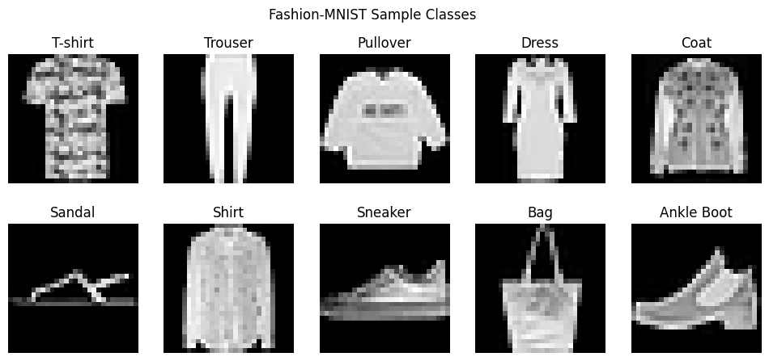
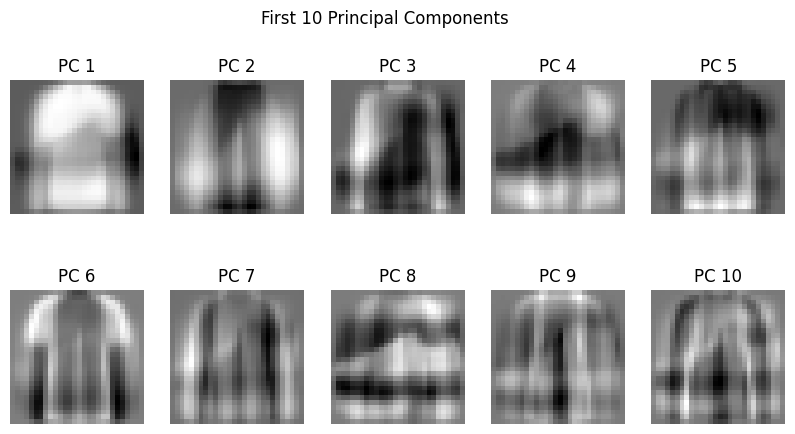
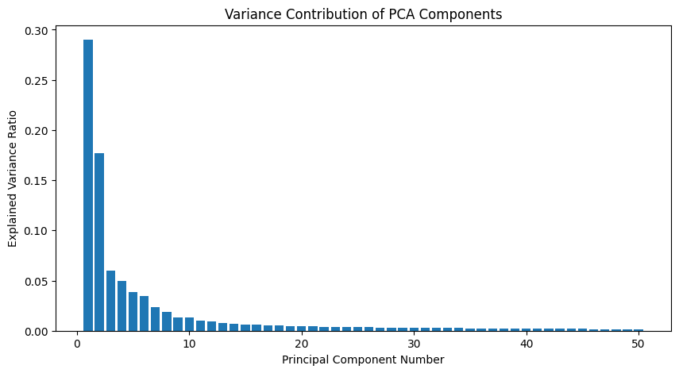
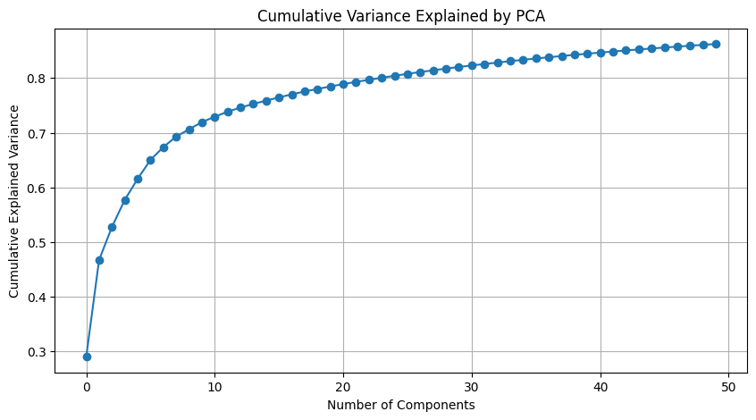
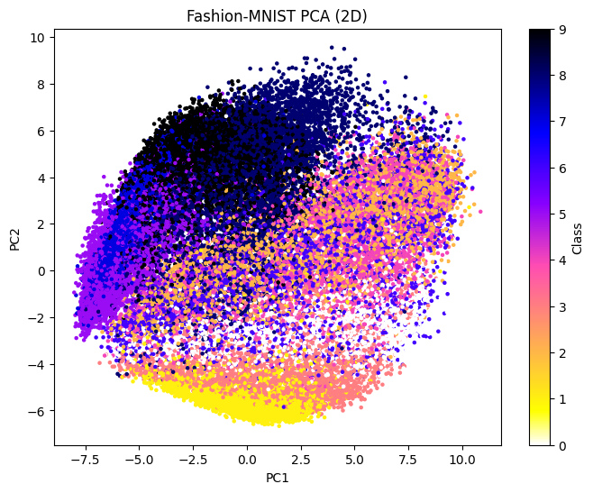
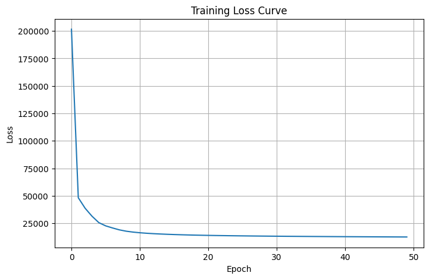
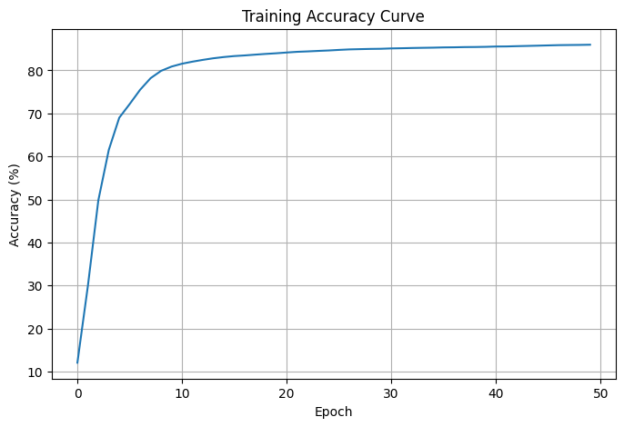
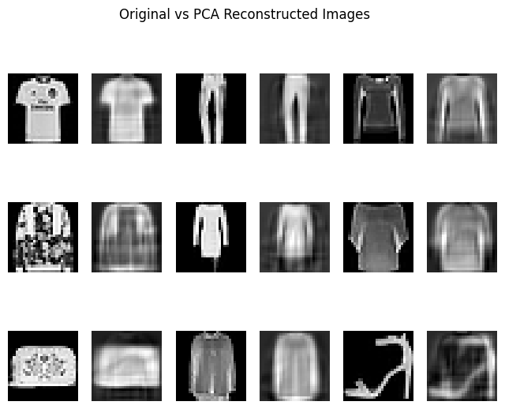
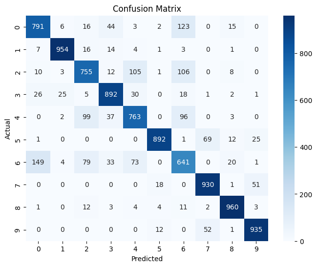
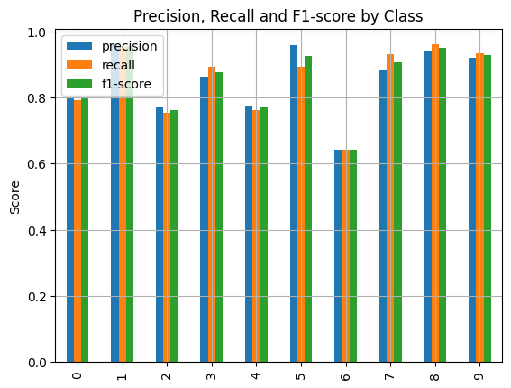

# 👕 Fashion-MNIST Classification using PCA and Custom Neural Network

> A complete machine learning project demonstrating dimensionality reduction using Principal Component Analysis (PCA) and image classification using a custom-built Multi-Layer Perceptron (MLP) Neural Network implemented from scratch.

📊 Dataset: Fashion-MNIST  
🧠 PCA Components: 50  
⚡ Feature Reduction: 93.62%  
🎯 Test Accuracy: ~85%  
🐍 Python Implementation from Scratch

---

# 📌 Project Overview

In modern image classification systems, high-dimensional image data often contains significant redundancy. Processing all available features increases computational complexity, memory consumption, and training time without necessarily improving predictive performance.

This project investigates whether **Principal Component Analysis (PCA)** can effectively reduce image dimensionality while preserving sufficient information for accurate classification using a **custom-built Multi-Layer Perceptron (MLP) Neural Network** implemented entirely from scratch.

The study utilizes the Fashion-MNIST dataset, a benchmark image dataset containing 70,000 grayscale images of fashion products across ten categories.

The central research question explored in this project is:

> Can dimensionality reduction significantly decrease computational requirements while maintaining effective image classification performance?

The results demonstrate that reducing image dimensionality from **784 features to 50 principal components** preserves most of the useful visual information and enables the neural network to achieve approximately **85% classification accuracy** on unseen test data.

---

# 🎯 Objectives

The primary objectives of this project are:

✅ Understand image-based classification using neural networks

✅ Explore dimensionality reduction using Principal Component Analysis (PCA)

✅ Build a custom Multi-Layer Perceptron (MLP) from scratch

✅ Evaluate the impact of dimensionality reduction on classification performance

✅ Analyze class-wise performance using confusion matrices and classification metrics

✅ Demonstrate the trade-off between computational efficiency and predictive accuracy

---

# 📊 Dataset Description

## Fashion-MNIST Dataset

Fashion-MNIST is a benchmark dataset introduced by Zalando Research as a replacement for the traditional handwritten digit MNIST dataset.

### Dataset Statistics

| Attribute          | Value     |
| ------------------ | --------- |
| Training Images    | 60,000    |
| Test Images        | 10,000    |
| Total Images       | 70,000    |
| Image Size         | 28 × 28   |
| Features per Image | 784       |
| Number of Classes  | 10        |
| Color Format       | Grayscale |

---

## Class Labels

| Label | Category      |
| ----- | ------------- |
| 0     | T-Shirt / Top |
| 1     | Trouser       |
| 2     | Pullover      |
| 3     | Dress         |
| 4     | Coat          |
| 5     | Sandal        |
| 6     | Shirt         |
| 7     | Sneaker       |
| 8     | Bag           |
| 9     | Ankle Boot    |

---

# 🔍 Dataset Exploration

## Fashion-MNIST Sample Classes

### Interpretation

The figure displays representative samples from each Fashion-MNIST category.

Several classes exhibit highly distinctive visual structures:

* Trouser
* Bag
* Ankle Boot

while others display significant visual overlap:

* Shirt
* T-Shirt
* Pullover
* Coat

This similarity creates a challenging classification problem and explains the misclassification patterns observed later in the analysis.

---

# ⚙️ Data Preprocessing

## Step 1: Feature Scaling

Pixel intensities originally range between:

0 → 255

To improve learning stability, Min-Max Normalization was applied:

Normalized Value = (X - Min) / (Max - Min)

### Benefits

* Faster convergence
* Stable gradient updates
* Improved numerical performance

---

# 📉 Principal Component Analysis (PCA)

## Why PCA?

The original dataset contains 784 features per image.

Many neighboring pixels contain similar information, introducing redundancy.

PCA transforms the original feature space into a smaller set of orthogonal components that capture maximum variance.

---

## Dimensionality Reduction Results

| Metric            | Value  |
| ----------------- | ------ |
| Original Features | 784    |
| PCA Components    | 50     |
| Feature Reduction | 93.62% |

### Key Insight

The dimensionality reduction process removed over 93% of the original feature space while retaining the majority of meaningful visual information.

---

# 🧠 PCA Component Analysis

### Interpretation

The first principal components capture dominant visual structures present across Fashion-MNIST images.

These include:

* Object contours
* Shape boundaries
* Edge information
* Structural patterns

Rather than representing individual clothing items, the components represent latent visual patterns shared among all images.

---

# 📈 Explained Variance Analysis

### Interpretation

The explained variance plot shows the amount of information contributed by each principal component.

Key observations:

* Early components capture substantial variance.
* Later components contribute progressively less information.
* Most meaningful information is concentrated within the first few components.

This validates the effectiveness of PCA for feature compression.

---

# 📈 Cumulative Variance Analysis

### Interpretation

The cumulative variance curve rises rapidly before stabilizing.

This indicates that a relatively small number of principal components retain most of the useful information contained within the original 784-dimensional image space.

---

# 🎨 PCA-Based Dataset Visualization

### Interpretation

The 2D PCA projection provides a visual representation of class separability.

Distinct clusters indicate classes that are easier to classify.

Overlapping clusters correspond to categories such as:

* Shirt
* Pullover
* Coat

which exhibit high visual similarity.

---

# 🤖 Neural Network Architecture

The classification model is a custom Multi-Layer Perceptron implemented from scratch using feed-forward propagation and backpropagation.

## Architecture

Input Layer: 50 Neurons

↓

Hidden Layer 1: 15 Neurons

↓

Hidden Layer 2: 16 Neurons

↓

Output Layer: 10 Neurons

### Training Configuration

| Parameter           | Value   |
| ------------------- | ------- |
| Learning Rate       | 0.01    |
| Epochs              | 50      |
| Activation Function | Sigmoid |
| Output Classes      | 10      |

---

# 📉 Training Loss Analysis

### Interpretation

The loss curve demonstrates a consistent decline throughout training.

This behavior indicates:

* Successful optimization
* Effective learning
* Stable convergence

The rapid reduction during early epochs suggests that the model quickly learned dominant visual patterns present within the dataset.

---

# 📈 Training Accuracy Analysis

### Interpretation

Training accuracy improved from approximately:

12% → 85%

This progression confirms that the network successfully learned discriminative representations from PCA-transformed features.

The absence of severe fluctuations indicates stable learning dynamics.

---

# 🎯 Model Performance

## Test Accuracy

| Metric        | Value |
| ------------- | ----- |
| Test Accuracy | ~85%  |

### Interpretation

Despite reducing dimensionality by more than 93%, the model maintained strong classification performance.

This demonstrates that PCA successfully preserved the information required for accurate prediction.

---

# 🔄 PCA Reconstruction Analysis

### Interpretation

The reconstructed images preserve:

✅ Object shape

✅ Structural boundaries

✅ Visual identity

while losing:

❌ Fine texture

❌ Minor pixel details

This confirms that PCA effectively compresses image information without destroying class-specific characteristics.

---

# 📌 Confusion Matrix Analysis

### Interpretation

The confusion matrix highlights class-wise prediction behavior.

### Strongest Classes

* Trouser
* Bag
* Ankle Boot

### Most Confused Classes

* Shirt ↔ T-Shirt
* Pullover ↔ Coat
* Shirt ↔ Pullover

These errors are consistent with the visual similarity observed during dataset exploration.

---

# 📋 Classification Report

### Interpretation

The classification report evaluates:

* Precision
* Recall
* F1-Score

for each category.

### Best Performing Categories

🥇 Trouser

🥈 Bag

🥉 Ankle Boot

### Most Challenging Category

⚠️ Shirt

The results indicate that visually distinctive objects are classified more effectively than visually overlapping clothing categories.

---

# 📖 Comparative Analysis

| Aspect                  | Without PCA               | With PCA |
| ----------------------- | ------------------------- | -------- |
| Features                | 784                       | 50       |
| Memory Usage            | High                      | Low      |
| Training Complexity     | High                      | Low      |
| Computation Time        | Higher                    | Lower    |
| Classification Accuracy | Slightly Higher Potential | ~85%     |
| Interpretability        | Moderate                  | High     |

### Key Finding

PCA dramatically reduces computational cost while maintaining competitive classification performance.

---

# 💡 Business Impact & Applications

The methodology developed in this project can be applied to:

🛍️ Fashion Product Classification

🛒 E-Commerce Product Tagging

🔍 Visual Search Systems

📦 Inventory Management

🤖 Automated Product Recognition

📱 Edge AI Applications

🏭 Manufacturing Quality Inspection

---

# 📚 Key Insights

✔ Fashion-MNIST contains significant feature redundancy.

✔ PCA successfully reduced dimensionality by over 93%.

✔ Neural networks can learn effectively from compressed features.

✔ Visual similarity among clothing categories remains the primary source of classification errors.

✔ PCA and MLP together provide an efficient and computationally economical classification framework.

---

# 🏁 Final Conclusion

This study demonstrates that intelligent feature extraction can significantly reduce computational complexity without substantially sacrificing predictive performance.

By transforming 784-dimensional image data into 50 principal components, PCA preserved the essential visual information required for classification. The custom-built Multi-Layer Perceptron successfully learned these compressed representations and achieved approximately 85% test accuracy.

The findings highlight the practical value of combining dimensionality reduction techniques with neural network learning to create efficient, scalable, and interpretable image classification systems.

---

## 👨‍💻 Author

**Mayur Shetty**

M.Sc. Data Science & Artificial Intelligence

Machine Learning | Deep Learning | Data Analytics | AI Research
